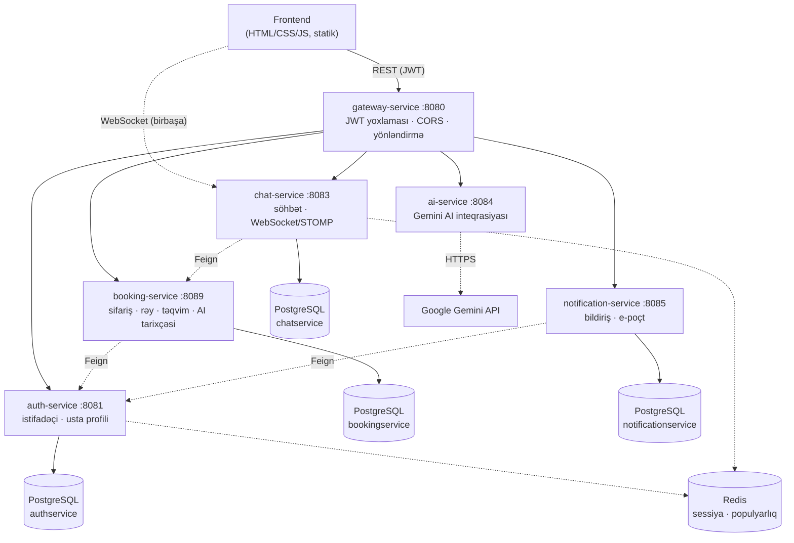

<p align="center">
  
</p>

<h1 align="center">SIGNUM ANIMAE</h1>

<p align="center">
  <em>Tatuaj ustaları ilə müştəriləri birləşdirən mikroservis əsaslı bazar platforması</em>
</p>

<p align="center">
  
  
  
  
  
  
  
</p>

---

## Bu layihə nədir?

**SIGNUM ANIMAE**, müştərilərin tatuaj ustası tapıb sifariş verdiyi, canlı yazışdığı, qiymət danışdığı və nəticədə rəy yazdığı; ustaların isə sifarişlərini idarə etdiyi, profilini qurduğu və öz statistikasını izlədiyi bir bazar tətbiqidir. Üstəlik, hələ heç kimlə əlaqə saxlamadan **AI Studiya**da tatuaj ideyası haqqında məsləhət almaq və ya bir eskizi süni intellektə analiz etdirmək mümkündür.

Backend altı ayrı Spring Boot mikroservisindən ibarətdir, frontend isə heç bir framework olmadan, saf **HTML / CSS / JavaScript** ilə yazılıb.

## İçindəkilər

- [Özəlliklər](#özəlliklər)
- [Memarlıq](#memarlıq)
- [Servislər](#servislər)
- [Texnologiyalar](#texnologiyalar)
- [İşə salmaq](#i̇şə-salmaq)
- [Layihə strukturu](#layihə-strukturu)
- [Testlər](#testlər)
- [Bilinən məhdudiyyətlər](#bilinən-məhdudiyyətlər)
- [Gələcək planlar](#gələcək-planlar)

## Özəlliklər

### 👤 Hesab və profil
- E-poçt/şifrə ilə qeydiyyat və JWT əsaslı giriş, rol seçimi (müştəri / usta)
- Hər iki rol üçün profil idarəetməsi (ad, şəhər, avatar); usta üçün əlavə olaraq bio, təcrübə ili və stillər

### 🔍 Usta kəşfi
- Şəhər, stil, minimum reytinq və minimum təcrübəyə görə süzgəclənən axtarış
- Nəticələri reytinqə və ya təcrübəyə görə sıralamaq
- Redis-dəki profil-baxış sayğacına əsaslanan "populyar ustalar" siyahısı

### 📅 Sifariş və təqvim
- Tarix, qeyd, təxmini büdcə və eskiz linki ilə sifariş yaratmaq
- Sifariş statusunun idarə edilməsi (gözləyir → təsdiqlənib → tamamlanıb / ləğv edilib)
- Ustanın öz uyğunluq təqvimini qurması; müştərinin bu boş vaxtlardan birini seçərək birbaşa sifariş verməsi

### 💬 Canlı söhbət
- Hər sifariş üçün ayrıca söhbət otağı, WebSocket/STOMP ilə real-vaxt mesajlaşma
- Qiymət təklifi (OFFER) mesaj növü — qəbul/rədd statusu ilə
- Oxunmamış mesaj sayğacı, WebSocket kəsiləndə REST-ə keçən "fallback" rejim

### ⭐ Rəylər
- Yalnız tamamlanmış sifarişə rəy yazıla bilir
- Usta rəyə ictimai cavab yaza bilir

### 📊 Analitika
- Usta üçün sifariş sayları (gözləyən/təsdiqlənmiş/tamamlanmış/ləğv edilmiş), tamamlanmış sifarişlərdən ümumi qazanc, profil baxış sayı və qiymət təkliflərinin qəbul nisbəti

### 🤖 AI Studiya
- Mətnlə tatuaj konsepti təsvir et, Azərbaycan dilində strukturlaşdırılmış məsləhət al (konsept, yerləşmə, qiymət aralığı)
- Bir eskiz/şəkil yüklə, süni intellektə analiz etdir
- Bəyəndiyin nəticəni saxla və istəsən mövcud bir sifarişinə bağla

## Memarlıq

Bütün xarici sorğular tək bir qapıdan — **gateway-service**-dən keçir; o, JWT-ni yoxlayır və sorğunu path-ə görə düzgün servisə yönləndirir. Yeganə istisna canlı söhbətin WebSocket bağlantısıdır — brauzer bu bağlantını birbaşa chat-service-ə açır, çünki Spring Cloud Gateway-in HTTP proxy hissəsi protokol "upgrade"ini ötürə bilmir.



## Servislər

| Servis | Port | Baza | Məsuliyyət |
|---|---|---|---|
| **gateway-service** | 8080 | — | JWT yoxlaması, CORS, path-based yönləndirmə |
| **auth-service** | 8081 | `signum_animae_authservice` | qeydiyyat/giriş, istifadəçi və usta profili, populyarlıq (Redis) |
| **booking-service** | 8089 | `signum_animae_bookingservice` | sifariş, rəy, uyğunluq təqvimi, AI Studiya tarixçəsi |
| **chat-service** | 8083 | `signum_animae_chatservice` | canlı söhbət (WebSocket/STOMP), presence (Redis) |
| **ai-service** | 8084 | — (stateless) | Gemini AI ilə tatuaj konsepti məsləhəti və şəkil analizi |
| **notification-service** | 8085 | `signum_animae_notificationservice` | daxili bildirişlər, e-poçt (SMTP) |

Hər servis tam müstəqil bir Gradle layihəsidir (öz `gradlew`-i ilə) — "database-per-service" prinsipinə uyğun olaraq eyni PostgreSQL instansında, amma tam ayrı adlı öz bazasına sahibdir.

## Texnologiyalar

**Backend:** Java 17 · Spring Boot 4 · Spring Cloud Gateway (WebMVC) · Spring Data JPA (Hibernate) · Spring Security · Spring WebSocket + STOMP · Spring Data Redis · Spring Mail · OpenFeign · PostgreSQL · Redis · JWT (jjwt) · Lombok · Gradle

**Test:** JUnit 5 · Mockito · AssertJ

**AI:** Google Gemini API (birbaşa REST inteqrasiyası, WebClient ilə)

**Frontend:** Saf HTML / CSS / JavaScript — heç bir framework, heç bir build addımı yoxdur

## İşə salmaq

**Tələb olunanlar:** JDK 17, PostgreSQL (localhost:5432), Redis (localhost:6379).

1. PostgreSQL-də dörd ayrı baza yarat: `signum_animae_authservice`, `signum_animae_bookingservice`, `signum_animae_chatservice`, `signum_animae_notificationservice` (cədvəllər Hibernate tərəfindən avtomatik yaradılır, əl ilə miqrasiya lazım deyil).
2. Aşağıdakı mühit dəyişənlərini təyin et: `Username`, `Password` (Postgres), `JWT_SECRET`, `KEY` (Gemini API açarı), `MAIL_USERNAME`, `MAIL_PASSWORD` (bildiriş e-poçtu üçün). `INTERNAL_SERVICE_TOKEN` təyin olunmasa, lokal inkişaf üçün defolt dəyərlə işləyir.
3. Hər servisi öz qovluğunda ayrıca başlat (məsələn `./gradlew bootRun`) — sıra fərq etmir, amma gateway-i ən sonda başlatmaq daha rahatdır: `auth-service` (8081), `booking-service` (8089), `chat-service` (8083), `ai-service` (8084), `notification-service` (8085), sonda `gateway-service` (8080).
4. `frontend` qovluğunda sadə bir statik server qaldır (məsələn `python -m http.server 5500`) və brauzerdə aç. Ətraflı: [`frontend/README.md`](frontend/README.md).

## Layihə strukturu

```
SIGNUM ANIMAE/
├── gateway-service/        JWT yoxlaması, CORS, path-based yönləndirmə
├── auth-service/           istifadəçi/usta profili, qeydiyyat-giriş
├── booking-service/        sifariş, rəy, təqvim, AI tarixçəsi
├── chat-service/           canlı söhbət (WebSocket/STOMP)
├── ai-service/             Gemini AI inteqrasiyası
├── notification-service/   daxili bildiriş və e-poçt
└── frontend/               saf HTML/CSS/JS istifadəçi interfeysi
```

## Testlər

Hər servisdə Mockito ilə yazılmış "unit" testlər var — real bazaya toxunmadan yalnız məntiqin özünü yoxlayır: sifariş yaradarkən müştəri ID-sinin həmişə doğrulanmış çağırandan götürülməsi, "keçmiş tatuajlar" siyahısının qiymət/qeyd kimi məxfi sahələri heç vaxt sızdırmaması, istifadəçi profilinin e-poçtunu yalnız sahibinə göstərməsi, qiymət təklifi statistikasının düzgün hesablanması və s.

## Bilinən məhdudiyyətlər

Tələbə layihəsi olaraq real vaxt məhdudiyyətləri daxilində bəzi yerlərdə şüurlu şəkildə sadə yol seçilib: bildirişin yaradılması hazırda backend deyil, frontend tərəfindən tetiklənir; chat-service-in WebSocket bağlantısı ayrıca JWT yoxlaması aparmır (istifadəçi kimliyi bağlantı zamanı ötürülür, çünki socket gateway-i keçmədən birbaşa chat-service-ə qoşulur); servislərarası daxili çağırışlarda çağıranın ötürdüyü ID birbaşa etibar edilən şəkildə qəbul olunur. Bunlar layihənin canlı demo zamanı sabit qalması üçün bilə-bilə seçilmiş, sənədləşdirilmiş qərarlardır.

## Gələcək planlar

- [ ] Giriş/qeydiyyat üçün rate limiting
- [ ] Admin/moderasiya paneli
- [ ] Servislərarası tam "sıfır-etibar" doğrulama modeli
- [ ] Docker/konteyner dəstəyi

---

<p align="center"><sub>SIGNUM ANIMAE — <em>ruhun möhürü</em></sub></p>
