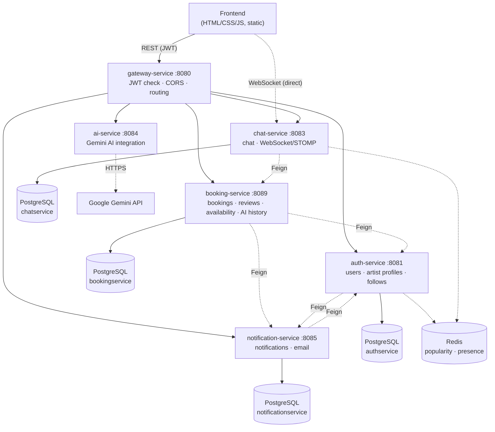

<p align="center">
  
</p>

<h1 align="center">SIGNUM ANIMAE</h1>

<p align="center">
  <em>A microservices-based marketplace connecting tattoo artists with customers</em>
</p>

<p align="center">
  <a href="https://signumanimae.kananpeoiks.me"><b>▶ Live demo</b></a>
</p>

<p align="center">
  
  
  
  
  
  
  
  
</p>

---

## What is this project?

**SIGNUM ANIMAE** is a marketplace application where customers find a tattoo artist, place a booking, chat live, negotiate a price, and leave a review afterwards — while artists manage their incoming bookings, build out their profile, and track their own stats. On top of that, an **AI Studio** lets anyone get a structured tattoo-concept consultation, or have an uploaded sketch analyzed, without contacting anyone.

The backend is made up of six independent Spring Boot microservices, and the frontend is written in plain **HTML / CSS / JavaScript** with no framework at all.

### Try it

The live demo is seeded with artists, bookings, reviews and conversations:

| Role | Email | Password |
|---|---|---|
| Customer | `musteri1@signumdemo.local` | `Demo12345` |
| Artist | `usta1@signumdemo.local` | `Demo12345` |

> Everything is live, the AI Studio included — nothing is stubbed out or mocked.

## Table of contents

- [Features](#features)
- [Architecture](#architecture)
- [Security model](#security-model)
- [Services](#services)
- [Tech stack](#tech-stack)
- [Running it locally](#running-it-locally)
- [Deployment](#deployment)
- [Project structure](#project-structure)
- [Tests](#tests)
- [Roadmap](#roadmap)

## Features

### 👤 Accounts & profiles
- Email/password registration and JWT-based login, with a role choice (customer / artist)
- Profile management for both roles (name, city, avatar); artists additionally manage bio, years of experience and styles
- Password reset by email, and email verification shown as a profile badge — verification never blocks login, so existing accounts keep working

### 🔍 Artist discovery
- Search filtered by city, style, minimum rating and minimum experience
- Sort results by rating or by experience
- A "popular artists" list driven by a Redis-backed profile-view counter
- Follow the artists you like and find them again under "İzlədiklərim"

### 📅 Bookings & availability
- Create a booking with a date, notes, an estimated budget and a sketch link
- Booking status lifecycle (pending → confirmed → completed / cancelled)
- Artists can set their own availability slots; customers can pick one of those open windows straight from the artist's profile to book

### 💬 Live chat
- A dedicated chat room per booking, with real-time messaging over WebSocket/STOMP
- A price-offer (OFFER) message type — accepting one updates the booking's agreed price
- Unread-message counter, presence and typing indicators, and a REST fallback that keeps chat working if the WebSocket connection drops
- History loads newest-first with a "load older messages" button, so a long conversation never blocks the screen

### ⭐ Reviews
- A review can only be left on a completed booking
- Artists can post a public reply to a review

### 📊 Analytics & moderation
- For artists: booking counts by status, total earnings from completed bookings, profile view count, and the acceptance rate of sent price offers
- For admins: a platform-wide view — user counts by role, banned users, sign-ups over the last 7/30 days, top cities, booking totals, average rating and estimated revenue — plus user banning and review moderation

### 🤖 AI Studio
- Describe a tattoo concept in text and get a structured consultation (concept, placement, price range)
- Upload a sketch/image and have it analyzed by AI
- Save a result you like, and optionally link it to one of your existing bookings

### ⚙️ Throughout
- Every list endpoint is paginated (`?page=&size=`), with a consistent `content / totalElements / totalPages / number` response shape
- All user-facing messages are in Azerbaijani

## Architecture

Every external request goes through a single entry point — **gateway-service** — which validates the JWT and routes the request to the right service based on its path. The one exception is the live chat's WebSocket connection: the browser opens that connection directly to chat-service, because Spring Cloud Gateway's HTTP proxy layer can't forward a protocol "upgrade".



## Security model

The whole system rests on one rule: **a caller's identity is never taken from the request payload.**

- `gateway-service` verifies the JWT, strips any `X-User-Id` / `X-User-Role` header the client sent, and re-sets them from the verified token. That makes those headers the single source of truth downstream.
- Every service reads the caller from `X-User-Id` and checks ownership before answering — you can only read your own bookings, notifications, chat rooms, saved AI ideas and follows, and only act on rows that belong to you. Deliberately public endpoints (an artist's reviews, their free slots, the "past tattoos" list on a profile) stay open.
- `401` and `403` mean different things: 401 is "we don't know who you are" (the session ends), 403 is "we know, but you may not do this" (just an error message). Mixing them meant a single permission error used to log the user out.
- `chat-service` is the one service that must stay publicly reachable, because the gateway cannot proxy a WebSocket upgrade. It therefore verifies the JWT itself: its `JwtHeaderFilter` strips any incoming `X-User-Id` and rewrites it from the token's subject, and the WebSocket handshake requires a valid `?token=` rather than trusting a `userId` query parameter.
- In the cloud deployment only the frontend, the gateway and chat-service have public ingress. `auth`, `booking`, `notification`, `ai` and `redis` are internal-only.

## Services

| Service | Port | Database | Responsibility |
|---|---|---|---|
| **gateway-service** | 8080 | — | JWT validation, CORS, path-based routing, login/registration rate limiting |
| **auth-service** | 8081 | `signum_animae_authservice` | registration/login, user & artist profiles, follows, password reset, popularity (Redis) |
| **booking-service** | 8089 | `signum_animae_bookingservice` | bookings, reviews, availability calendar, AI Studio history |
| **chat-service** | 8083 | `signum_animae_chatservice` | live chat (WebSocket/STOMP), presence (Redis) |
| **ai-service** | 8084 | — (stateless) | Gemini-powered tattoo-concept consultation & image analysis |
| **notification-service** | 8085 | `signum_animae_notificationservice` | in-app notifications, email (SMTP) |

Each service is a fully independent Gradle project (with its own `gradlew`) — following a "database-per-service" approach, they share one PostgreSQL instance but each owns its own, separately named database.

## Tech stack

**Backend:** Java 17 · Spring Boot 4 · Spring Cloud Gateway (WebMVC) · Spring Data JPA (Hibernate) · Spring Security · Spring WebSocket + STOMP · Spring Data Redis · Spring Mail · OpenFeign · PostgreSQL · Redis · JWT (jjwt) · Lombok · Gradle

**Testing:** JUnit 5 · Mockito · AssertJ

**Infrastructure:** Docker · Docker Compose · Azure Container Apps · Azure Container Registry · Azure Database for PostgreSQL

**AI:** Google Gemini API (direct REST integration via WebClient)

**Frontend:** Plain HTML / CSS / JavaScript — no framework, no build step

## Running it locally

### With Docker (recommended)

Brings up all six services, PostgreSQL with its four databases, Redis, the frontend, and a local SMTP catcher — one command, nothing else installed:

```bash
cp .env.example .env     # fill in JWT_SECRET, and KEY if you want the AI Studio
docker compose up --build
```

| | |
|---|---|
| App | http://localhost:5500 |
| Outgoing email | http://localhost:8025 — caught by mailpit, never actually sent |

### Without Docker

**Prerequisites:** JDK 17, PostgreSQL (localhost:5432), Redis (localhost:6379).

1. Create four databases: `signum_animae_authservice`, `signum_animae_bookingservice`, `signum_animae_chatservice`, `signum_animae_notificationservice`. Tables are created by Hibernate — there are no manual migrations.
2. Set `Username` and `Password` (Postgres), `JWT_SECRET` (the same value for gateway, auth and chat), `KEY` (Gemini), `MAIL_USERNAME` / `MAIL_PASSWORD`. `INTERNAL_SERVICE_TOKEN` falls back to a local-dev default.
3. Start each service from its own folder with `./gradlew bootRun`.
4. Serve `frontend/` with any static server (`python -m http.server 5500`).

Every host in the configuration is an environment variable with a localhost default, so neither path needs a config edit to work on a developer machine.

## Deployment

The live instance runs on **Azure Container Apps**: eight containers in one environment, a single PostgreSQL Flexible Server holding the four databases, and images served from Azure Container Registry.

Only `js/config.js` differs between environments — it holds the API and WebSocket base URLs and nothing else.

Redeploying a service is a build, a push and a revision update (the frontend as an example):

```bash
az acr login -n signumanimaeacr
docker build --platform linux/amd64 -t signumanimaeacr.azurecr.io/frontend:v3 ./frontend
docker push signumanimaeacr.azurecr.io/frontend:v3
az containerapp update -g signum-rg -n signumanimae --image signumanimaeacr.azurecr.io/frontend:v3
```

Images are built locally because `az acr build` (ACR Tasks) is not available on Azure for Students subscriptions.

## Project structure

```
SIGNUM ANIMAE/
├── gateway-service/        JWT validation, CORS, routing, rate limiting
├── auth-service/           users, artist profiles, follows, password reset
├── booking-service/        bookings, reviews, calendar, AI history
├── chat-service/           live chat (WebSocket/STOMP)
├── ai-service/             Gemini AI integration
├── notification-service/   in-app notifications & email
├── frontend/               plain HTML/CSS/JS user interface
└── docker-compose.yml      the whole system, locally
```

## Tests

Each service has Mockito-based unit tests that check the logic itself without touching a real database: that creating a booking always uses the verified caller as the customer ID, that the "past tattoos" list never leaks private fields like price or notes, that a user's profile only reveals their email to its own owner, that a non-participant is refused when posting into a chat room, that price-offer statistics are computed correctly, and more.

```bash
cd auth-service && ./gradlew test    # and likewise for the other services
```

## Roadmap

- [x] Rate limiting on login/registration
- [x] Admin/moderation panel
- [x] Ownership checks on every endpoint
- [x] Pagination across all list endpoints
- [x] Password reset & email verification
- [x] Artist follow / favorites
- [x] Docker & Docker Compose support
- [x] Cloud deployment (Azure Container Apps)
- [x] Transactional email on a verified domain (Resend)
- [ ] Database migrations (Flyway)
- [x] Custom domain
- [ ] CI/CD pipeline

---

<p align="center"><sub>SIGNUM ANIMAE — <em>the seal of the soul</em></sub></p>
