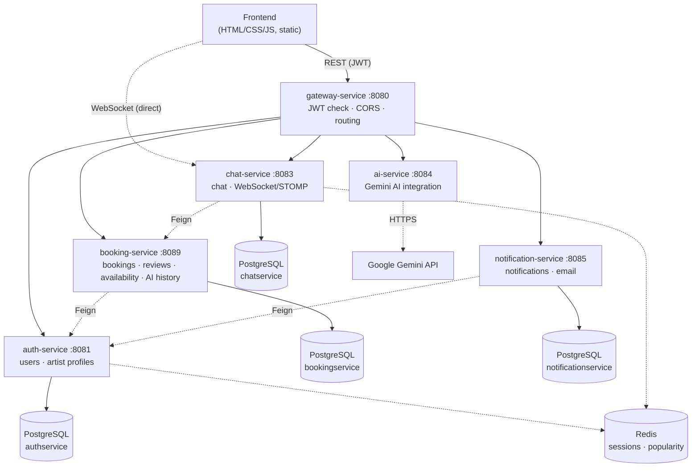

<p align="center">
  
</p>

<h1 align="center">SIGNUM ANIMAE</h1>

<p align="center">
  <em>A microservices-based marketplace connecting tattoo artists with customers</em>
</p>

<p align="center">
  
  
  
  
  
  
  
</p>

---

## What is this project?

**SIGNUM ANIMAE** is a marketplace application where customers find a tattoo artist, place a booking, chat live, negotiate a price, and leave a review afterwards — while artists manage their incoming bookings, build out their profile, and track their own stats. On top of that, an **AI Studio** lets anyone get a structured tattoo-concept consultation, or have an uploaded sketch analyzed, without contacting anyone.

The backend is made up of six independent Spring Boot microservices, and the frontend is written in plain **HTML / CSS / JavaScript** with no framework at all.

## Table of contents

- [Features](#features)
- [Architecture](#architecture)
- [Services](#services)
- [Tech stack](#tech-stack)
- [Getting started](#getting-started)
- [Project structure](#project-structure)
- [Tests](#tests)
- [Known limitations](#known-limitations)
- [Roadmap](#roadmap)

## Features

### 👤 Accounts & profiles
- Email/password registration and JWT-based login, with a role choice (customer / artist)
- Profile management for both roles (name, city, avatar); artists additionally manage bio, years of experience and styles

### 🔍 Artist discovery
- Search filtered by city, style, minimum rating and minimum experience
- Sort results by rating or by experience
- A "popular artists" list driven by a Redis-backed profile-view counter

### 📅 Bookings & availability
- Create a booking with a date, notes, an estimated budget and a sketch link
- Booking status lifecycle (pending → confirmed → completed / cancelled)
- Artists can set their own availability slots; customers can pick one of those open windows straight from the artist's profile to book

### 💬 Live chat
- A dedicated chat room per booking, with real-time messaging over WebSocket/STOMP
- A price-offer (OFFER) message type, with accepted/rejected status
- Unread-message counter, and a REST fallback that keeps chat working if the WebSocket connection drops

### ⭐ Reviews
- A review can only be left on a completed booking
- Artists can post a public reply to a review

### 📊 Analytics
- For artists: booking counts by status (pending/confirmed/completed/cancelled), total earnings from completed bookings, profile view count, and the acceptance rate of sent price offers

### 🤖 AI Studio
- Describe a tattoo concept in text and get a structured consultation (concept, placement, price range)
- Upload a sketch/image and have it analyzed by AI
- Save a result you like, and optionally link it to one of your existing bookings

## Architecture

Every external request goes through a single entry point — **gateway-service** — which validates the JWT and routes the request to the right service based on its path. The one exception is the live chat's WebSocket connection: the browser opens that connection directly to chat-service, because Spring Cloud Gateway's HTTP proxy layer can't forward a protocol "upgrade".



## Services

| Service | Port | Database | Responsibility |
|---|---|---|---|
| **gateway-service** | 8080 | — | JWT validation, CORS, path-based routing |
| **auth-service** | 8081 | `signum_animae_authservice` | registration/login, user & artist profiles, popularity (Redis) |
| **booking-service** | 8089 | `signum_animae_bookingservice` | bookings, reviews, availability calendar, AI Studio history |
| **chat-service** | 8083 | `signum_animae_chatservice` | live chat (WebSocket/STOMP), presence (Redis) |
| **ai-service** | 8084 | — (stateless) | Gemini-powered tattoo-concept consultation & image analysis |
| **notification-service** | 8085 | `signum_animae_notificationservice` | in-app notifications, email (SMTP) |

Each service is a fully independent Gradle project (with its own `gradlew`) — following a "database-per-service" approach, they share one PostgreSQL instance but each owns its own, separately named database.

## Tech stack

**Backend:** Java 17 · Spring Boot 4 · Spring Cloud Gateway (WebMVC) · Spring Data JPA (Hibernate) · Spring Security · Spring WebSocket + STOMP · Spring Data Redis · Spring Mail · OpenFeign · PostgreSQL · Redis · JWT (jjwt) · Lombok · Gradle

**Testing:** JUnit 5 · Mockito · AssertJ

**AI:** Google Gemini API (direct REST integration via WebClient)

**Frontend:** Plain HTML / CSS / JavaScript — no framework, no build step

## Getting started

**Prerequisites:** JDK 17, PostgreSQL (localhost:5432), Redis (localhost:6379).

1. Create four separate PostgreSQL databases: `signum_animae_authservice`, `signum_animae_bookingservice`, `signum_animae_chatservice`, `signum_animae_notificationservice` (tables are created automatically by Hibernate — no manual migrations needed).
2. Set the following environment variables: `Username`, `Password` (Postgres), `JWT_SECRET`, `KEY` (Gemini API key), `MAIL_USERNAME`, `MAIL_PASSWORD` (for notification emails). `INTERNAL_SERVICE_TOKEN` falls back to a local-dev default if left unset.
3. Start each service separately from its own folder (e.g. `./gradlew bootRun`) — the order doesn't strictly matter, but it's easiest to start the gateway last: `auth-service` (8081), `booking-service` (8089), `chat-service` (8083), `ai-service` (8084), `notification-service` (8085), then `gateway-service` (8080).
4. Serve the `frontend` folder with any static server (e.g. `python -m http.server 5500`) and open it in a browser. Details: [`frontend/README.md`](frontend/README.md).

## Project structure

```
SIGNUM ANIMAE/
├── gateway-service/        JWT validation, CORS, path-based routing
├── auth-service/           user & artist profiles, registration/login
├── booking-service/        bookings, reviews, calendar, AI history
├── chat-service/           live chat (WebSocket/STOMP)
├── ai-service/             Gemini AI integration
├── notification-service/   in-app notifications & email
└── frontend/               plain HTML/CSS/JS user interface
```

## Tests

Each service has Mockito-based unit tests that check the logic itself without touching a real database: that creating a booking always uses the verified caller as the customer ID, that the "past tattoos" list never leaks private fields like price or notes, that a user's profile only reveals their email to its own owner, that price-offer statistics are computed correctly, and more.

## Known limitations

As a student project built under real time constraints, a few deliberate simplifications were made: notification creation is currently triggered by the frontend rather than the backend itself; chat-service's WebSocket connection doesn't perform its own JWT check (the caller's identity is passed at connection time, since the socket connects directly to chat-service without going through the gateway); and internal service-to-service calls trust the caller-supplied ID directly rather than re-verifying it. These are conscious, documented trade-offs made to keep the live demo stable.

## Roadmap

- [ ] Rate limiting on login/registration
- [ ] Admin/moderation panel
- [ ] A full zero-trust verification model between services
- [ ] Docker/container support

---

<p align="center"><sub>SIGNUM ANIMAE — <em>the seal of the soul</em></sub></p>
